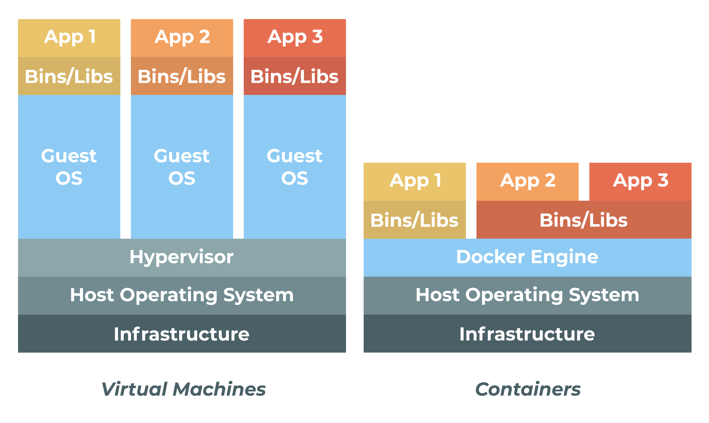

# docker-demo
A demo Flask+Redis app to demonstrate writing Dockerfiles and docker-compose

## What is Docker?

Docker is a containerization engine. 

### Ok, so what are containers?

You can think of a container like a lightweight virtual machine, running only what it needs and only having the minimum files needed. Containers solve the problem of "it works on my machine" by shipping a working machine along with your app. Virtual machines do the same, but at the much higher cost of having to run an entire OS. 

## Bare-Metal Setup

### Virtual Environments and Package Management
A virtual environment is useful to keep packages on your system clean. Use the following 
commands to generate and activate a virtual environment for this app: `python3 -m venv env && source env/bin/activate`

Now that you are in your virtual evironment, you can install the packages specified by your 
requirements.txt file. These packages will be installed to the virtual environment, not your 
global system. Use `pip install -r requirements.txt`

### Running Your App
First, make sure Redis is installed and running. On Debian/Ubuntu, this can be done with `sudo apt install redis`

You can run your app with the following command: `gunicorn demo:APP --bind=localhost:5000`

Awesome! You now have a working thingy. Now we're gonna make it work better

## Running in Docker
First off, create the Docker network we'll use so the containers can talk to each other with `docker network create bridge br0`. Next, start Redis with the following command: `docker run --name redis --detach --interactive --tty --rm --publish 6379:6379 --network br0 redis`

Next, build the docker image with `docker build -t docker-demo .`. Then run with the command `docker run --name docker-demo --detach --interactive --tty --rm --publish 80:8080 --network br0 --env REDIS_HOST="redis" docker-demo`

You can now `curl localhost` and get your counter!

## Docker Compose

Docker Compose makes deploying apps trivial. To deploy the app with the provided docker-compose file, simply run `docker-compose up -d` and it will build and deploy the application and database in the background with networking already configured.

## Notes

### Redis for Development
Docker is extremely useful for running something like a database without installing it on your system. To run a temporary Redis instance that binds to `localhost:6379`, use the following command: `docker run --name redis --detach --interactive --tty --rm --publish 6379:6379 redis`

This can also be written as `docker run --rm --name -dit redis -p 6379:6379 redis`

### References:
- [Install Docker](https://docs.docker.com/engine/install/)
- [Install docker-compose](https://docs.docker.com/compose/install/)
- [Dockerfile](https://docs.docker.com/engine/reference/builder/)
- [docker run](https://docs.docker.com/engine/reference/run/)
- [docker-compose](https://docs.docker.com/compose/compose-file/compose-file-v3/)
